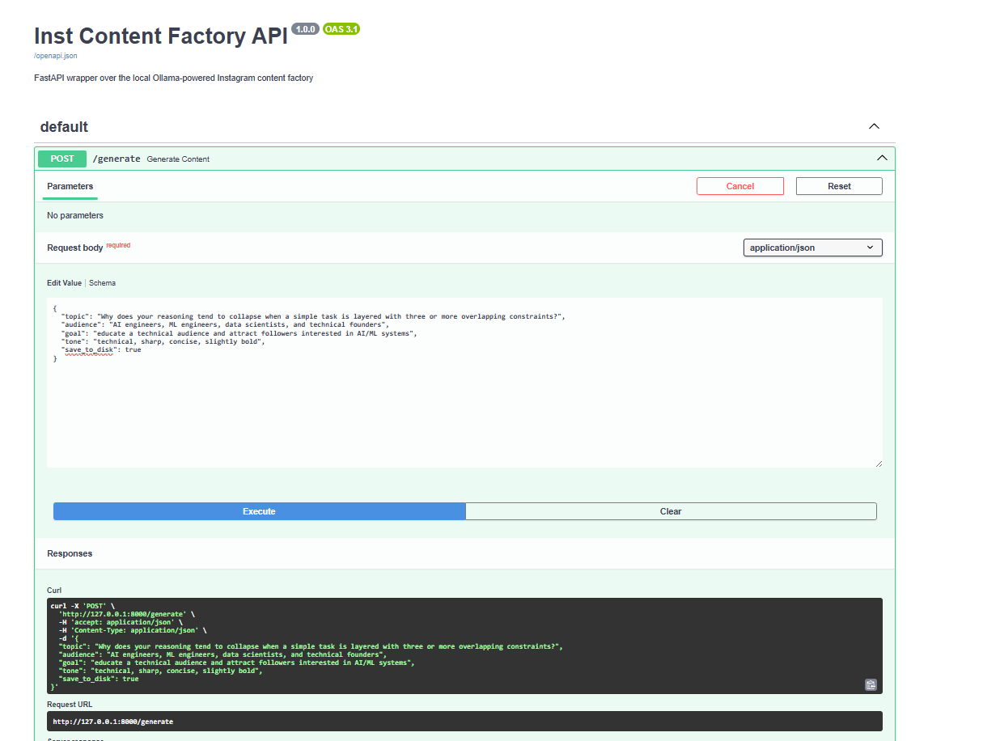
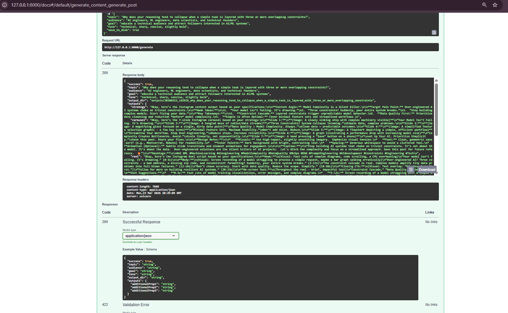

# Instagram AI Content Factory

Local AI-powered Instagram content generation pipeline using FastAPI and Ollama.

This project generates:
- content strategy
- Instagram carousel copy
- reel scripts
- final edited content

The system is structured as a sequential, role-based pipeline with separate prompt stages for strategy, creation, and editing.

## Repository Overview

This repository provides a local content generation workflow for Instagram content using:
- FastAPI for the API layer
- Ollama for local model inference
- YAML files for agent and task definitions
- Python orchestration for the end-to-end pipeline

## Architecture

This project uses a sequential multi-role pipeline:

```text
Input -> Strategist -> Carousel Creator + Reel Creator -> Editor -> Saved Outputs / API Response
```

It is best described as a role-based prompt pipeline rather than a fully autonomous multi-agent system.

### Pipeline Stages

1. **Strategist**
   - defines the content angle
   - identifies the audience pain point
   - generates hooks
   - outlines key takeaways

2. **Carousel Creator**
   - converts the strategy into a slide-by-slide Instagram carousel

3. **Reel Creator**
   - converts the strategy into a short-form reel script

4. **Editor**
   - refines the generated outputs into a cleaner final version

## Project Structure

```bash
.
├── .gitignore
├── agents.yaml
├── app.py
├── crew.py
├── main.py
├── requirements.txt
├── tasks.yaml
├── outputs/
├── assets/
│   ├── github_repo.png
│   ├── api_docs.png
│   └── api_response.png
└── examples/
    └── sample_response.json
```

## Where to Put Screenshots

Create an `assets/` folder at the root of the repository and place the screenshots there.

Recommended structure:

```bash
assets/
├── github_repo.png
├── api_docs.png
└── api_response.png
```

Suggested mapping for your current screenshots:

- GitHub repository screenshot -> `assets/github_repo.png`
- Swagger UI form screenshot -> `assets/api_docs.png`
- API response screenshot -> `assets/api_response.png`

## Screenshots

### Repository Structure


### FastAPI Swagger UI



### API Response Example



## Installation

Clone the repository and install dependencies:

```bash
git clone https://github.com/your-username/instagram-ai-content-factory.git
cd instagram-ai-content-factory
pip install -r requirements.txt
```

## Requirements

- Python 3.10+
- Ollama installed locally
- A local model available in Ollama
- FastAPI dependencies from `requirements.txt`

## Running Ollama

Make sure Ollama is installed and running, and that the model you want to use is available.

Example:

```bash
ollama run llama3
```

Adjust the model name if your implementation expects a different one.

## Running the API

Start the FastAPI server:

```bash
uvicorn app:app --reload
```

Open the API docs in your browser:

```text
http://127.0.0.1:8000/docs
```

## API Endpoint

### `POST /generate`

Generates the full content pipeline output.

### Example Request Body

```json
{
  "topic": "Why does your reasoning tend to collapse when a simple task is layered with three or more overlapping constraints?",
  "audience": "AI engineers, ML engineers, data scientists, and technical founders",
  "goal": "educate a technical audience and attract followers interested in AI/ML systems",
  "tone": "technical, sharp, concise, slightly bold",
  "save_to_disk": true
}
```

## Example cURL Request

```bash
curl -X 'POST' \
  'http://127.0.0.1:8000/generate' \
  -H 'accept: application/json' \
  -H 'Content-Type: application/json' \
  -d '{
  "topic": "Why does your reasoning tend to collapse when a simple task is layered with three or more overlapping constraints?",
  "audience": "AI engineers, ML engineers, data scientists, and technical founders",
  "goal": "educate a technical audience and attract followers interested in AI/ML systems",
  "tone": "technical, sharp, concise, slightly bold",
  "save_to_disk": true
}'
```

## Example JSON Output

Add the response JSON file to an `examples/` folder in the repository:

```bash
examples/
└── sample_response.json
```

Then keep this link in the README so GitHub redirects the reader directly to the JSON file:

[View sample JSON response](examples/sample_response.json)

## Example Response Structure

The API returns:
- request metadata
- output directory path
- generated strategy
- generated carousel copy
- generated reel script
- final edited output

A typical response includes keys such as:

```json
{
  "success": true,
  "topic": "...",
  "audience": "...",
  "goal": "...",
  "tone": "...",
  "output_dir": "outputs/...",
  "outputs": {
    "strategy": "...",
    "carousel": "...",
    "reel": "...",
    "final": "..."
  }
}
```

## Output Files

When `save_to_disk` is enabled, generated content is written to the `outputs/` directory.

Example structure:

```bash
outputs/
└── 20260323_162926_example_topic/
    ├── strategy.md
    ├── carousel.md
    ├── reel.md
    └── final.md
```

## Configuration Files

### `agents.yaml`

Defines the content roles used in the pipeline:
- strategist
- carousel_creator
- reel_creator
- editor

### `tasks.yaml`

Defines the task instructions and expected outputs for each role.

## Core Files

### `crew.py`
Contains the orchestration logic:
- loads YAML configuration
- builds prompts
- calls the LLM
- coordinates the content pipeline

### `app.py`
Provides the FastAPI application and `/generate` endpoint.

### `main.py`
Provides a CLI entrypoint for running the content generation flow outside the API.

## CLI Usage

Example:

```bash
python main.py \
  --topic "AI system failures under constraint overload" \
  --audience "AI engineers" \
  --goal "educate technical followers" \
  --tone "technical, concise"
```

## Design Notes

This project is useful for:
- local content generation workflows
- rapid social media content prototyping
- structured prompt pipelines
- testing multi-role content generation patterns

It does **not** currently implement:
- autonomous agent planning
- agent memory
- tool-using agents
- dynamic delegation between agents

## Recommended Improvements

Potential next steps:
- add a README badge section
- add environment variable documentation
- document model configuration in detail
- add unit tests
- add request and response schemas to the README
- add Docker support
- add a real agent framework if autonomous behavior is desired

## Suggested Repository Additions

To make the repository easier to understand on GitHub, add:

```bash
assets/
examples/
README.md
```

Recommended final structure:

```bash
.
├── .gitignore
├── README.md
├── agents.yaml
├── app.py
├── crew.py
├── main.py
├── requirements.txt
├── tasks.yaml
├── assets/
│   ├── github_repo.png
│   ├── api_docs.png
│   └── api_response.png
├── examples/
│   └── sample_response.json
└── outputs/
```
